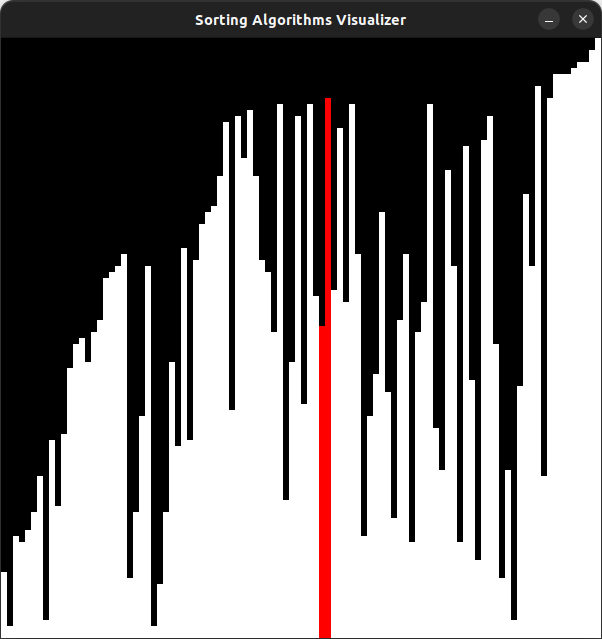

# sorting-algorithms-visualizer



# Installation of dependencies

- On Linux:
```
sudo apt install cmake libsdl2-dev g++
```

# Running

- On Linux:
```
    git clone https://github.com/unreformable1/sorting-algorithms-visualizer.git
    cd sorting-algorithms-visualizer/tools/
    bash run.sh
```

# License

[MIT License](https://choosealicense.com/licenses/mit/)